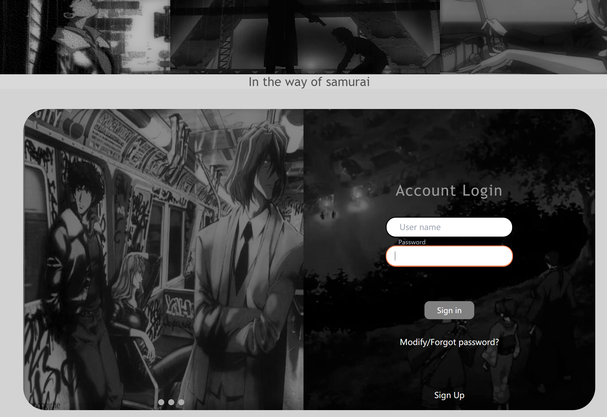
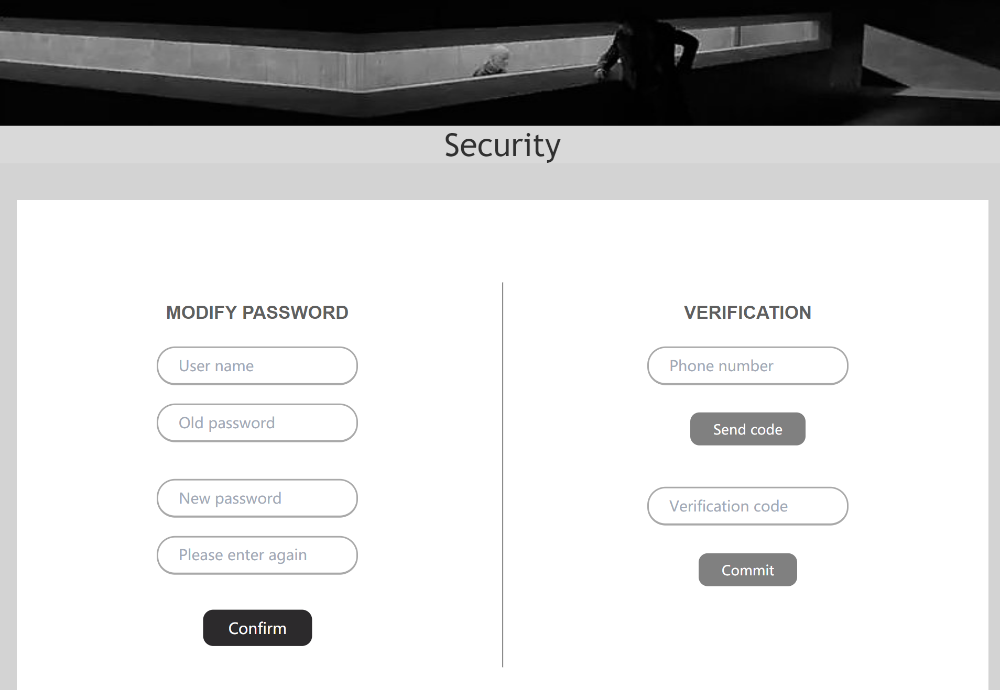
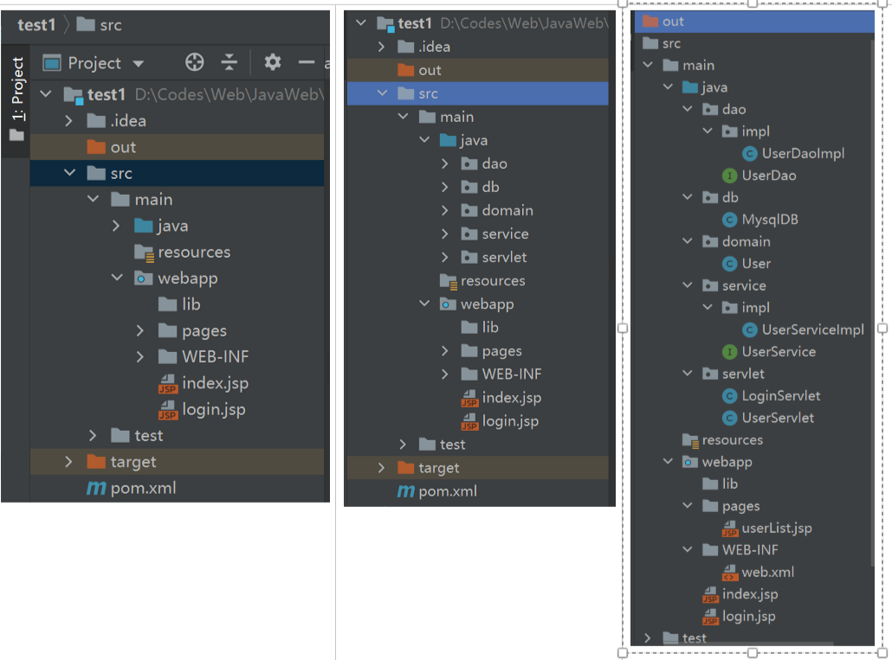

# web-login
------
**一个java-web实现的登录界面**

HTML展示(无后端功能): [login](https://shanxiansen310.github.io/Mugen-web/login_page/prac-Login/website.html)

▼主要有以下功能:

1.纯js实现的轮播图(点击切换,自动轮播,左右滑动)

2.用户账号密码登录,修改密码,忘记密码后通过手机验证码修改密码

3.手机短信验证码登录(阿里云)

4.用户数据采用mysql存储

5.管理员账号登陆可以实现对用户的CURD操作

▼使用到的技术:
html/css/js/ajax + tomcat + mysql + maven

使用了mvc开发模式

#### 界面展示:
登录界面:

密码及验证码:

#### 项目文件结构展示:

这里采用了mvc的开发模式:
MVC 是一种使用 MVC（Model View Controller 模型-视图-控制器）设计创建 Web 应用程序的模式
* Model（模型）表示应用程序核心（比如数据库记录列表）
* View（视图）显示数据（数据库记录）
* Controller（控制器）处理输入（写入数据库记录）

虽然是个很简单的项目,但提前学习了解下这种开发模式还是挺有意义的!!!
这种分层的开发模式能够降低耦合性,功能分的很清楚,在大型项目中会极大提高开发效率

tips:
* 在用户输入上用了一点小技巧,使用了placeholder-shown伪类来实现占位符的交互,即用户未输入时会有占位符,点击输入框后,提示信息会悬浮上去
* 关于验证的提示信息,比如密码错误,用户不存在这里是采用的ajax进行提醒的,这样就不会像jsp一样还进行页面的刷新